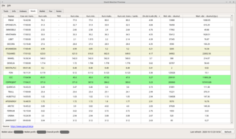
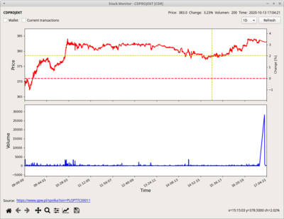

# Stock Monitor

Monitor and tools for Stock Exchange. Aggregates data from several sources in one place. Manages wallet adn favorite stocks.

## Features

- presenting Warsaw Stock Exchange data (https://www.gpw.pl/akcje)
- presenting common stock indicators (https://www.gpw.pl/wskazniki)
- listing stock financial reports dates (https://strefainwestorow.pl/dane/raporty/lista-dat-publikacji-raportow-okresowych/wszystkie)
- listing dividends dates (https://www.stockwatch.pl/dywidendy/)
- presenting global common indexes (https://www.bankier.pl/gielda/gieldy-swiatowe/indeksy)
- stock wallet
- favorities
- stock charts with full history 

## Screens

## Disclaimer

Depending on source data presented stock data may be delayed in relation to real time values.
Author is not responsible for any financial loss caused by misunderstanding data presented by the application. 

## Known issues:

- Cannot open externals hyperlinks under KDE: "Timeout on server www.google.com: Socket operation timed out"
  Try changing default application handling urls in *System Settings*->*Applications*->*Web Browser* from implicit application to explicit web browser (e.g. Firefox).

### Examples of not obvious Python mechanisms

- chaining redo/undo commands (*addfavcommand.py*)
- loading of UI files and inheriting from it
- properly killing (Ctrl+C) PyQt (*sigint.py*)
- persisting and versioning classes (*persist.py*)

## Data sources:

- (https://www.gpw.pl/akcje)
- (https://info.bossa.pl/notowania/pliki/intraday/metastock/)
- (https://www.gpw.pl/archiwum-notowan)
- (https://gpwbenchmark.pl/notowania)
- (https://www.bankier.pl/gielda/gieldy-swiatowe/indeksy)
- (https://www.gpw.pl/wskazniki)
- (https://strefainwestorow.pl/dane/raporty/lista-dat-publikacji-raportow-okresowych/wszystkie)
- (https://strefainwestorow.pl/dane/raporty/lista-dat-publikacji-raportow-okresowych/opublikowane)
- (https://www.stockwatch.pl/dywidendy/)
