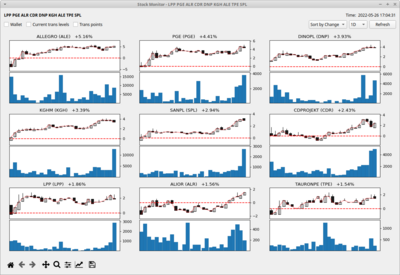

# Stock Monitor

Monitor and tools for Stock Exchange. 

Aggregates data from several sources in one place. Manages wallet and favorite stocks.

## Features

- presenting Warsaw Stock Exchange data (https://www.gpw.pl/akcje)
- presenting common stock indicators (https://www.gpw.pl/wskazniki)
- listing stock financial reports dates (https://strefainwestorow.pl/dane/raporty/lista-dat-publikacji-raportow-okresowych/wszystkie)
- listing dividends dates (https://www.stockwatch.pl/dywidendy/)
- presenting global common indexes (https://www.bankier.pl/gielda/gieldy-swiatowe/indeksy)
- ESPI reports (https://www.gpw.pl/komunikaty)
- stock wallet
- favorities
- stock charts with full history 

## Screens

## Disclaimer

Depending on data source, presented stock values may be delayed in relation to real time values.
Author is not responsible for any financial loss caused by misunderstanding of data presented by the application. 

## Running application

To run application try one of:
- run `src/startmonitor`
- execute `cd src; python3 -m stockmonitor`

Moreover there are two configuration scripts:
- `src/configure_menu.sh` -- adds application shortcut in OS main menu
- `src/configure_autostart.sh` -- adds application to OS autostart list

Help output of `startmonitor --help` can be found [here](doc/help_startmonitor.md).

### Requirements

Required dependency packages are needed to be installed before first run of main application. To do it execute one of commands:
- `src/install-deps.sh`
- `pip3 install -r ./src/requirements.txt`

### Virtual environment

It is possible to run project in virtual environment. Configuration of the environment is as simple as execution of `tools/installvenv.sh` script. Script assumes that following components are preinstalled:
- *Python* version 3
- *venv* module (tested on version 20.8.1)

Script alongside the environemnt installs dependencies stated in previous paragraph.

Starting environment after installation can be done by execution of script `{venv_dir}/startvenv.sh`. Moreover there are local versions of `startmonitor`, `configure_menu.sh` and `configure_autostart.sh` executing those programs in virtual environment context.

## Data grabber

In addition to main application there is grabber script `grabdata.py` extracting data used in the application. The script can be 
used separatelly from main application to scrap data to local file. For further information run script `src/grabdata.py --help`.

Supported output formats:
- CSV
- XLS
- pickle (`pandas.core.DataFrame` object will be stored)

What data can be obtained using the script? Script scraps for example:
- GPW stock data
- GPW stock intraday data
- dividends calendar
- financial reports calendar
- global stock indexes

Help output of `grabdata.py --help` can be found [here](doc/help_grabdata.md).

## Transactions info

Another command-line script `transactioninfo.py` allows extracting data related to stock transactions. Script reads CSV 
file with list of transactions and generates various outputs:
- matches of buy and sell transactions (FIFO order)
- current state of wallet (stock that is not sold out)
- detailed list of wallet buy transactions

Help output of `transactioninfo.py --help` can be found [here](doc/help_transactioninfo.md).

## Known issues:

- Cannot open externals hyperlinks under KDE: "Timeout on server www.google.com: Socket operation timed out"
  Try changing default application handling urls in *System Settings*->*Applications*->*Web Browser* from implicit application to explicit web browser (e.g. Firefox).

### Examples of not obvious Python mechanisms

- scrapping data from Html using *pandas* (tables) and *BeautifulSoup* (lists) 
- processing data in background thread preventing GUI blockage
- elided QLabel (*elidedlabel.py*)
- chaining redo/undo commands (*addfavcommand.py*)
- loading of UI files and inheriting from it
- properly killing (Ctrl+C) PyQt (*sigint.py*)
- persisting and versioning classes (*persist.py*)

## Data sources:

- shares and rights to shares (https://www.gpw.pl/akcje)
- intraday prices (https://info.bossa.pl/notowania/pliki/intraday/metastock/)
- price archive (https://www.gpw.pl/archiwum-notowan)
- market quotations (https://gpwbenchmark.pl/notowania)
- worldwide markets indices (https://www.bankier.pl/gielda/gieldy-swiatowe/indeksy)
- market indicators (https://www.gpw.pl/wskazniki)
- ESPI/EBI company reports (https://www.gpw.pl/komunikaty)
- financial reports calendar (https://strefainwestorow.pl/dane/raporty/lista-dat-publikacji-raportow-okresowych/wszystkie)
- financial reports calendar (https://strefainwestorow.pl/dane/raporty/lista-dat-publikacji-raportow-okresowych/opublikowane)
- dividends (https://www.stockwatch.pl/dywidendy/)
